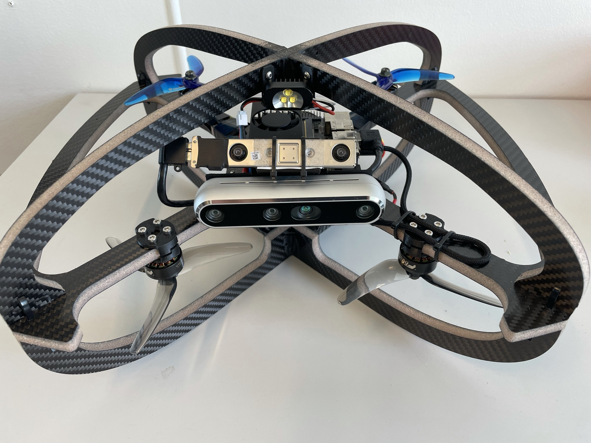

# Learning-based Micro Flyer (LMF) Gazebo model + world files

This repo contains the Gazebo model for LMF drone as well as the world files for training and evaluating learning-based [navigation methods](https://github.com/ntnu-arl/ORACLE) for LMF.

## Usage

```bash
roslaunch rmf_sim rmf_sim.launch
```

## Details

LMF is a quadrotor that inherited the collision-tolerant design of the [Resilient Micro Flyer](https://ieeexplore.ieee.org/document/9292583), yet with an increased diameter of $0.43\textrm{m}$ and a mass of $1.2\textrm{kg}$. It integrates a Realsense D455 to obtain depth and RGB data, a PixRacer Ardupilot-based autopilot delivering velocity and yaw-rate control, and a Realsense T265 fused with the IMU of the autopilot allowing it to estimate the velocity, orientation and angular rates of the robot. An image of the real hardware is given below.

